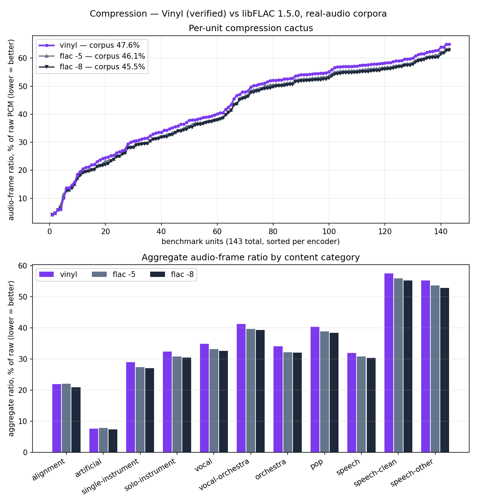
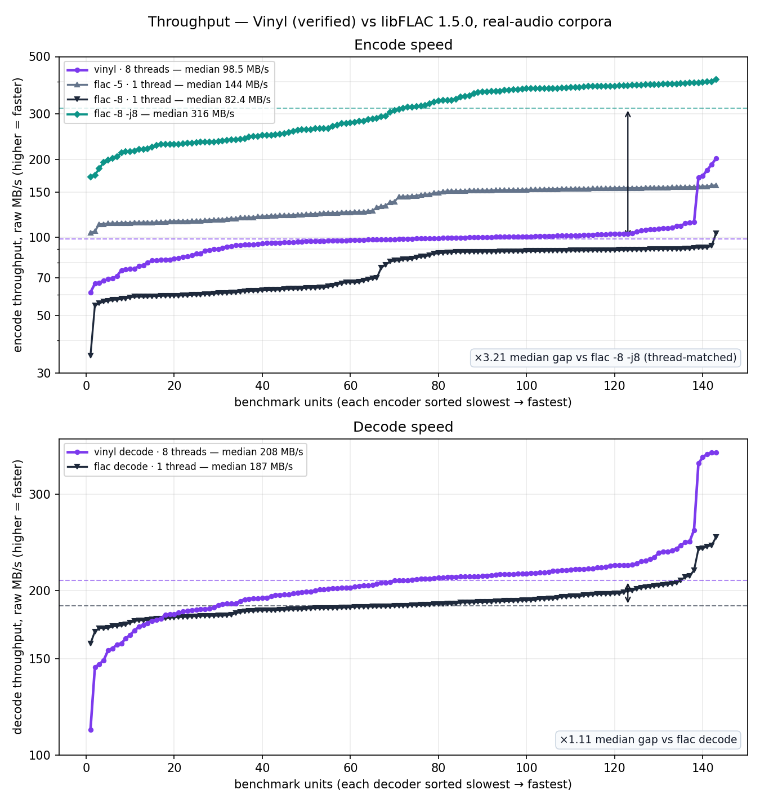

# Vinyl

**A formally verified FLAC codec in pure Lean 4.**

Vinyl implements a FLAC ([RFC 9639](references/rfc9639.txt)) encoder and
decoder with no FFI, together with machine-checked proofs. The main
correctness theorem — kernel-certified losslessness of the shipped
encoder/decoder pair — is
[`Flac.decode_encode`](Flac/Spec/Decode.lean#L2271):

```lean
/-- Decoding an encoded stream recovers the audio exactly,
    for every well-formed input. -/
theorem Flac.decode_encode (a : Audio) (h : a.WellFormed) :
    decode (encode a) = .ok a
```

Here [`Audio.WellFormed`](Flac/Native/Stream.lean#L304) says exactly
"representable as FLAC" — 1–8 equal-length channels, bit depth 1–32,
samples in range for the bit depth, and the STREAMINFO field bounds — and
it is **decidable**, so the precondition can be tested at runtime. The
checked encoder [`Flac.encodeChecked`](Flac/Native/Codec.lean#L25) does
exactly that, which turns the runtime check itself into the theorem's
premise ([`Flac.decode_encodeChecked`](Flac/Spec/Decode.lean#L2278)):

```lean
/-- If the checked encoder returns bytes at all, decoding them
    recovers the audio. No hypotheses. -/
theorem Flac.decode_encodeChecked
    (h : encodeChecked a = some bytes) : decode bytes = .ok a
```

At the byte level the same guarantee holds for raw PCM files
([`Flac.decodePcm16_encodePcm16`](Flac/Spec/Decode.lean#L2692)):

```lean
/-- If encoding a raw 16-bit PCM byte array succeeds at all,
    decoding the resulting FLAC file returns exactly the input
    bytes. No hypotheses. -/
theorem Flac.decodePcm16_encodePcm16
    (h : encodePcm16 ch bytes = some flac) : decodePcm16 flac = .ok bytes
```

This matters because `decode_encode` speaks about the structured
`Audio` value, while what a user actually holds is a flat interleaved
signed 16-bit little-endian PCM `ByteArray` (a `.wav` payload, a sound
card buffer). The corollary extends the sample-level capstone across
the remaining conversion glue — channel deinterleaving and byte
packing, proved to round-trip as well — so **no unverified code sits
between the user's bytes and the guarantee**: it is the end-to-end
contract for the file-level API (and the `vinyl` CLI), and the single
hypothesis-free statement to audit if that is the interface you use.
(The "16" is only the byte layout of this front end; the codec and the
theorems above cover bit depths 1–32.)

The statements quantify over every encoder knob: block size, numbering
strategy, stereo-decorrelation mode, wasted bits, subframe types, Rice
parameters and partitions
([`Flac.decode_encode_cfg`](Flac/Spec/Decode.lean#L2259)). The encoder
validates each heuristic choice against a decidable certificate and falls
back to VERBATIM when the check fails, so **arbitrary — even
adversarial — heuristics cannot break correctness**: they only choose
*which* valid stream is emitted.

The proof is layered: a verified *reference* decoder over a `List Bool`
bit model carries the round-trip proof
([`Flac.Stream.decodeReference_encode`](Flac/Spec/Stream.lean#L316)); the
shipped *production* decoder (a buffered `ByteArray` reader) is proven to
compute exactly the same function on every input
([`decodeOption_eq_reference`](Flac/Spec/Decode.lean), accept-set
transfer [`decode_ok_iff_reference`](Flac/Spec/Decode.lean#L2249)); and
both are *total* — no `partial`, no panics — so the decoder terminates on
arbitrary bytes. Interoperability with the real world is established
separately by differential testing against libFLAC (below).

## Status

Milestones M0–M5 are complete and M6 (performance under the theorem
ratchet) has largely landed: every decoder fast path is proven equal to
its bit-level specification, *including* frame-parallel decoding
([`readFramesFast_eq`](Flac/Spec/Decode.lean#L2119)), parallel PCM
serialization ([`pcm16FastPar_eq`](Flac/Spec/Decode.lean#L2638)), and
frame-parallel *serialization* — where each frame worker emits its own
frame's bytes and
[`decodeBytes_spec`](Flac/Spec/PcmBytes.lean#L702) proves the result is
exactly the interleaved PCM of the decoded samples. That last one
*narrowed* the trusted surface: the window concatenation the previous
serializer performed was asserted in prose and unprovable, because it
reasons through `Task`.

**M6b has landed too: the shipped encoder is proven, not certified.**
[`Flac.Encode.encodePcm16_eq`](Flac/Spec/Encode.lean) proves the fast
encoder — its `Float` search, its `UInt64` bit writer, its per-frame
workers — *computes* `Flac.Stream.encode` at the `EncoderCfg` whose chooser
is its own search, so the byte-level round trip follows from the reference
capstone with no runtime decode and no fallback. The runtime certificate
that used to buy that guarantee is gone, and with it 30% of encode time.
M7 (two-sided verification against RFC 9639) is a stretch goal. See [`PLAN.md`](PLAN.md) §8 for the milestone-by-milestone
roadmap and [`PROGRESS.md`](PROGRESS.md) for the session log. In short:
bit-level I/O, CRCs, MD5, Rice coding, all subframe types (CONSTANT /
VERBATIM / FIXED / LPC), 1–8 channels with stereo decorrelation, wasted
bits, and the buffered production decoder are all done and under the
capstone theorems above.

## What of RFC 9639 is covered

Everything needed to *decode the "streamable subset"* of FLAC and to
*encode within it*: all subframe types (LPC orders 1–32), Rice/Rice2
residuals with escapes, 1–8 channels with all three stereo-decorrelation
modes, wasted bits, both numbering strategies, CRC-8/CRC-16, and MD5.
The full feature-by-feature table — and the explicit list of what decode
*rejects* (headerless streams, reserved codes, …) — is in
[`COVERAGE.md`](COVERAGE.md). On the
[IETF conformance corpus](https://github.com/ietf-wg-cellar/flac-test-files)
the must-decode `subset/` set passes **61/61** comparable files.

## Differential testing

The theorems prove encoder and decoder agree with *each other*;
agreement with the rest of the world is tested against libFLAC 1.5.0.
[`conformance/`](conformance/README.md) holds the rigs: `smoke.sh`
(both directions on synthetic signals), `ietf.sh` (the RFC 9639 corpus;
merge gate), and `fuzz.sh` (decoder-totality, bit-flip, and compiled
round-trip fuzzing). `scripts/check.sh` is the ratchet: full build,
**zero `sorry`/`axiom`**, grep-pinned capstones, totality lint, unit
suite. To run the cross-check yourself on one file, see
[Cross-checking against libFLAC](#cross-checking-against-libflac) below.

The real-audio benchmark doubles as the largest of these rigs: on all 143 units
— 1.73 GiB of SQAM and LibriSpeech recordings — `flac -t` accepts Vinyl's
stream and its MD5, Vinyl's decoder reproduces the input exactly, and Vinyl's
decoder reproduces **libFLAC's `flac -8` output byte-for-byte**.

## Benchmarks

Two suites, reported separately: **real audio** — 143 units, 1.73 GiB of EBU
SQAM and LibriSpeech recordings — and the **synthetic micro-benchmark** corpus
of 37 generated 1 MB signals. Methodology, corpus descriptions and the full
tables are in [`bench/README.md`](bench/README.md).

Compression, as the coded audio-frame payload (libFLAC writes 8.8 kB of
padding, seektable and vendor comment per file; Vinyl writes 42 bytes of
STREAMINFO, so whole-file comparisons measure metadata policy):

| corpus | Vinyl | `flac -5` | `flac -8` |
|---|---|---|---|
| real audio, 143 units | 47.6% | 46.1% | **45.5%** |
| synthetic, 37 files | 39.6% | 40.2% | **39.0%** |

**`flac -8` compresses better than Vinyl on both corpora** — in all eleven
real-audio categories, and on 142 of 143 real units. The median real unit is
4.7% larger than `flac -8`'s output. An earlier version of this section claimed
Vinyl beat `flac -8` on the synthetic corpus; that was a whole-file comparison,
and libFLAC's fixed metadata was four times the difference being claimed. It is
[retracted](bench/README.md#what-the-real-corpus-settled).

Speed on the real corpus, total raw MB ÷ total seconds. Vinyl's encoder and
decoder are frame-parallel, and libFLAC 1.5.0 takes `-j`, so the thread count is
part of every row:

| | Vinyl | libFLAC | gap |
|---|---|---|---|
| **decode** | 205 MB/s (8 thr) | 189 MB/s (1 thr) | **0.92×** |
| encode vs `flac -8 -j8` | 94 MB/s (8 thr) | 319 MB/s (8 thr) | 3.40× |
| encode vs `flac -8` | 94 MB/s (8 thr) | 77 MB/s (1 thr) | 0.82× |
| encode vs `flac -5` | 94 MB/s (8 thr) | 140 MB/s (1 thr) | 1.49× |

The gap column is libFLAC ÷ Vinyl, so **below 1.00 means Vinyl is faster**.

**Decode is the direction that holds up**: 1.08× ahead of libFLAC per
invocation, faster on 120 of 143 units — though with 8 threads against 1,
because libFLAC has no multithreaded decoder to match. **Encode does not**:
thread-matched, `flac -8` is 3.4× faster *and* compresses better, and even
single-threaded `flac -5` is 1.5× faster while compressing better. There is no
libFLAC preset here that Vinyl beats on both axes.

Per-unit profiles — compression cactus above, throughput below:





### What is proven, and what the benchmark tests instead

Every decoder fast path is proven equal to its bit-level specification —
frame-parallel decoding ([`readFramesFast_eq`](Flac/Spec/Decode.lean#L2119)),
parallel PCM serialization
([`pcm16FastPar_eq`](Flac/Spec/Decode.lean#L2638)), and frame-parallel
*serialization*, where each worker emits its own frame's bytes and
[`decodeBytes_spec`](Flac/Spec/PcmBytes.lean#L702) proves the result is exactly
the interleaved PCM of the decoded samples. That last step *narrowed* the
trusted surface: the window concatenation the previous serializer performed was
asserted in prose and unprovable, because it reasons through `Task`.

Interoperability is not proven, so it is measured. On all 143 real units,
outside the timed intervals: `flac -t` accepts Vinyl's stream and its MD5;
Vinyl's decoder reproduces the input exactly; and **Vinyl's decoder reproduces
libFLAC's `-8` output byte-for-byte** — 1.73 GiB of real audio encoded at
libFLAC's widest search, decoded by the verified decoder with no mismatch.

**The runtime certificate is gone.** The fast encoder used to decode its own
output with the verified decoder and compare, falling back to the verified
encoder on any mismatch — which is what made
`decodePcm16_encodePcm16Fast` hypothesis-free without proving anything
about the encoder. That cost 30% of encode time on a 32 MB probe — the
encoder went 68.5 → 97.7 MB/s when it came out — and it is now a theorem
instead: `Flac.Encode.encodePcm16_eq`. The capstone's *statement* did not
change by a character; only its proof did, and what it rests on shrank.

What made that possible is that `Float` never had to be characterised.
Float operations are opaque but *deterministic*, so the search and the
chooser the reference is instantiated with need only be the same function
on equal inputs — `f x = f x` needs no lemma about `f`. What `Float` does
forbid is a float reaching the *bytes*, and it used to: residuals were
folded into the stream straight off the search's `FloatArray`s. Emission
now goes through the exact `Int` residual, which cost 6% and bought
provability. [`ARCHITECTURE.md`](ARCHITECTURE.md) has the whole chain.

**Where the ratio gap comes from.** libFLAC's `-8` evaluates exactly one LPC
order per apodization window and one fixed order, buying its ratio with several
*windows*; Vinyl uses one window and costs three LPC orders plus all five fixed
orders exactly, computing its nine autocorrelation lags three per pass. That is
a more expensive search than libFLAC runs at any preset, and on synthetic signals
it came close — but on real audio the several windows win, which is the 4.7%.
`Flac.Heuristics.lpcCandidates` carries the whole measured tradeoff curve.

Both searches run in exact `Float` arithmetic over unboxed `FloatArray`:
every value they compute is an integer well inside 2^53, so doubles
represent them exactly and the subframe *chosen* is the one the `Int` form
would choose, at one hardware `fmul`/`fadd` per tap instead of
`lean_int_mul` on a boxed `Array Int`. That claim is about what `Float`
computes, so it is not a theorem and cannot be one; it is a compression
question, and a differential test pins it against the verified encoder on
every session. The *bytes* do not depend on it.

Per-category tables, the corpus descriptions, the size sweep, the stage-by-stage
optimization history, and regeneration instructions:
[`bench/README.md`](bench/README.md).

## Building

Requires [elan](https://github.com/leanprover/elan); the toolchain
(Lean 4.33.0) is pinned in `lean-toolchain`. No external Lean
dependencies.

```sh
lake build          # library + proofs (no sorry, no axioms in Flac/)
lake exe flactest   # golden-vector unit tests
```

## Command-line usage

`lake build vinyl` produces `.lake/build/bin/vinyl`, a small CLI over the
verified codec (`vinyl --help` lists the commands). It reads and writes
raw interleaved **signed 16-bit little-endian** PCM.

Generate sample `.flac`/`.pcm` pairs to play with (the directory must
exist; the `.flac` files are real FLAC — any player or tool accepts
them, e.g. `flac -t` or `ffplay`):

```sh
mkdir -p /tmp/vinyl-samples
lake exe vinyl --samples /tmp/vinyl-samples
```

Encode raw PCM (block size 4096, 2 channels) with the verified encoder —
if this succeeds, the round-trip is guaranteed by theorem — then decode
(`--decode` is the reference decoder, `--decode-fast` the shipped one)
and compare:

```sh
lake exe vinyl --encode input.pcm out.flac 4096 2
lake exe vinyl --decode-fast out.flac roundtrip.pcm
cmp input.pcm roundtrip.pcm
```

To make a raw PCM input from any audio file, use ffmpeg or the
reference `flac` tool:

```sh
ffmpeg -i song.mp3 -f s16le -acodec pcm_s16le -ac 2 -ar 44100 input.pcm
flac -d --force-raw-format --sign=signed --endian=little -o input.pcm song.flac
```

A larger corpus of synthetic test signals (tones, sweeps, noise, stereo
pairs, …) can be generated with `python3 bench/gen_corpus.py /tmp/corpus`.

## Cross-checking against libFLAC

To see with your own eyes that Vinyl and the reference implementation
(the `flac` CLI / libFLAC) do the same thing, run the same PCM bytes
through both codecs, in both directions, and compare byte-for-byte.
First produce a test signal:

```sh
mkdir -p /tmp/demo
lake exe vinyl --samples /tmp/demo
```

**Direction A** — Vinyl encodes; libFLAC verifies the stream
(`flac -t` checks CRC-8/16 and the MD5 signature), decodes it, and the
output must equal the input:

```sh
lake exe vinyl --encode /tmp/demo/stereo-corr.pcm A.flac 4096 2
flac -t A.flac
flac -d -f --force-raw-format --sign=signed --endian=little -o A-libflac.pcm A.flac
cmp /tmp/demo/stereo-corr.pcm A-libflac.pcm && echo byte-identical
```

**Direction B** — libFLAC encodes the same signal; Vinyl decodes it,
and the output must equal the input:

```sh
flac -f -8 --force-raw-format --sign=signed --endian=little \
     --channels=2 --bps=16 --sample-rate=44100 -o B.flac /tmp/demo/stereo-corr.pcm
lake exe vinyl --decode-fast B.flac B-vinyl.pcm
cmp /tmp/demo/stereo-corr.pcm B-vinyl.pcm && echo byte-identical
```

The two directions check different things. A shows libFLAC accepts and
agrees with Vinyl's *encoder* output; B shows Vinyl's *decoder* agrees
with libFLAC's encoder on a stream Vinyl did not produce. Neither is
covered by the theorems — they establish interoperability, which is
exactly why they are tested, not proved. (The Vinyl-encode →
Vinyl-decode leg in the middle *is* the part guaranteed by
`decodePcm16_encodePcm16`.) The automated version of this walkthrough,
run over a batch of signals, is
[`conformance/smoke.sh`](conformance/smoke.sh).

## Reading guide

- [`ARCHITECTURE.md`](ARCHITECTURE.md) — how the repository is organized
  and why (the trusted/tested split, the theorem layering L0–L6).
- [`PLAN.md`](PLAN.md) — the complete working plan: capstone statement,
  scope, theorem stack, known hard points, fuzzing/conformance rigs,
  milestones.
- [`COVERAGE.md`](COVERAGE.md) — feature-by-feature RFC 9639 coverage
  and conformance-corpus results.
- [`conformance/README.md`](conformance/README.md) — the differential
  testing and fuzzing rigs against libFLAC.
- [`bench/README.md`](bench/README.md) — compression and speed
  benchmarks vs libFLAC, with plots.
- [`CLAUDE.md`](CLAUDE.md) — contributor/agent workflow rules.
- [`PROGRESS.md`](PROGRESS.md) — per-session development log.
