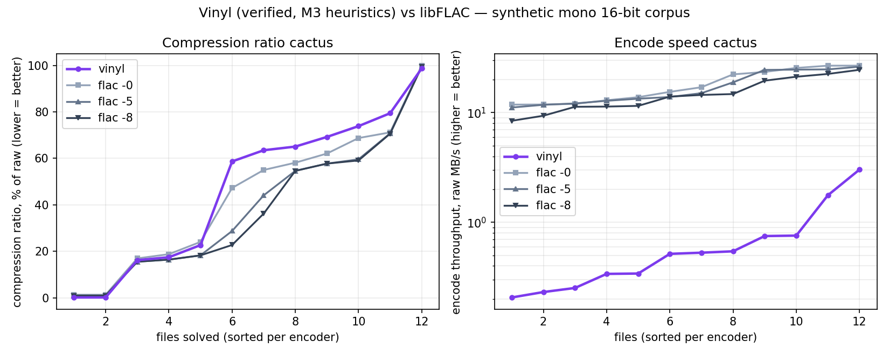

# Vinyl

**A formally verified FLAC codec in pure Lean 4.**

Vinyl implements a FLAC ([RFC 9639](references/rfc9639.txt)) encoder
and decoder with no FFI, together with machine-checked proofs — the goal is
a kernel-certified losslessness theorem:

```lean
theorem Flac.decode_encode (pcm : Audio) (opts : EncoderOptions)
    (hwf : pcm.WellFormed) (hopts : opts.WellFormed pcm) :
    Flac.decode (Flac.encode pcm opts) = .ok pcm
```

quantified over *all* well-formed audio and *all* encoder settings, so every
heuristic knob (LPC order search, apodization, partition search, …) is
correctness-irrelevant by construction. The methodology mirrors
[`lean-zip`](https://github.com/kim-em/lean-zip) (verified DEFLATE):
verified reference decoder, round-trip theorem as the merge ratchet,
reference→production transfer proof, and differential fuzzing against
libFLAC/ffmpeg for interoperability.

## Status

Milestones M0–M2 are complete, M3 is underway (see `PLAN.md §8` for the
roadmap and `PROGRESS.md` for the session log). The first end-to-end
theorem is in: for mono streams (any bit depth 1–32, any block size
16–65535, any valid heuristic) the kernel certifies

```lean
theorem Flac.Stream.decodeReference_encode_default ... :
    Stream.decodeReference (Stream.encode ⟨blockSize, sr, b, defaultChooser b⟩ pcm)
      = some pcm
```

and the emitted streams pass `flac -t` (CRCs + MD5) and decode
byte-identically with libFLAC (`conformance/smoke.sh`).

- [x] **M0** — bit-level I/O with round-trip proofs, CRC-8/CRC-16,
      extended-UTF-8 coded numbers with round-trip proof, pure-Lean MD5
      (RFC 1321 suite green)
- [x] **M1** — Rice/zigzag/escape coding + partitioned-residual proofs
      with divisibility certificates
- [x] **M2** — CONSTANT/VERBATIM/FIXED subframes, CRC-verified frames,
      stream layer; `decodeReference ∘ encode = id` on the mono profile;
      first libFLAC interop (both directions)
- [~] **M3** — certified default heuristic (fixed-order search + Rice
      estimate) done; LPC + its restore proof next
- [ ] **M4** — stereo modes, wasted bits, frames/stream; **reference
      capstone** over the full option space
- [ ] **M5** — production decoder + accept-set transfer; **shipped capstone**
- [ ] **M6** — performance work under the ratchet
- [ ] **M7** — (stretch) two-sided verification against RFC 9639

## Benchmarks

Cactus plots (per-encoder sorted curves, SAT-solver style) on the
synthetic mono 16-bit corpus of `bench/gen_corpus.py`, against libFLAC
1.5.0 — regenerate with `./bench/run.sh`:



Honest reading at M3: overall ratio **47.1%** of raw vs libFLAC's 43.7%
(`-0`) and 37.7% (`-8`) — Vinyl already beats `flac -0` on half the corpus
(tonal and trivial content) and loses where LPC matters (sweeps, sawtooth),
which is exactly the next milestone. Encode speed is ~0.4 MB/s vs libFLAC's
~14 MB/s: the encoder still runs on the proof-oriented bit model;
performance work is deliberately deferred to M6, *after* the capstone makes
optimization safe (PLAN.md §7).

## Building

Requires [elan](https://github.com/leanprover/elan); the toolchain
(Lean 4.33.0) is pinned in `lean-toolchain`. No external Lean dependencies.

```sh
lake build          # library + proofs (no sorry, no axioms in Flac/Spec/)
lake exe flactest   # golden-vector unit tests
```

## Reading guide

- [`ARCHITECTURE.md`](ARCHITECTURE.md) — how the repository is organized
  and why (the trusted/tested split, the theorem layering L0–L6).
- [`PLAN.md`](PLAN.md) — the complete working plan: capstone statement,
  scope, theorem stack, known hard points, fuzzing/conformance rigs,
  milestones.
- [`CLAUDE.md`](CLAUDE.md) — contributor/agent workflow rules.
- [`PROGRESS.md`](PROGRESS.md) — per-session development log.
