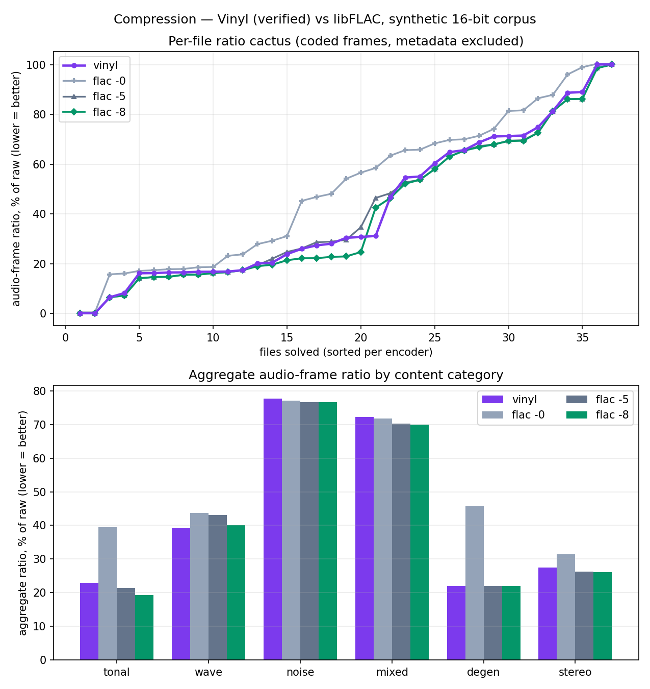
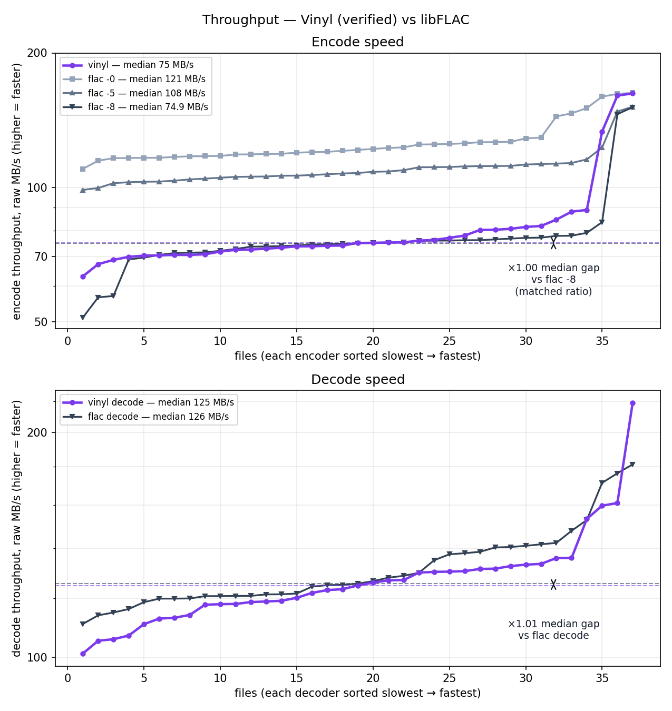
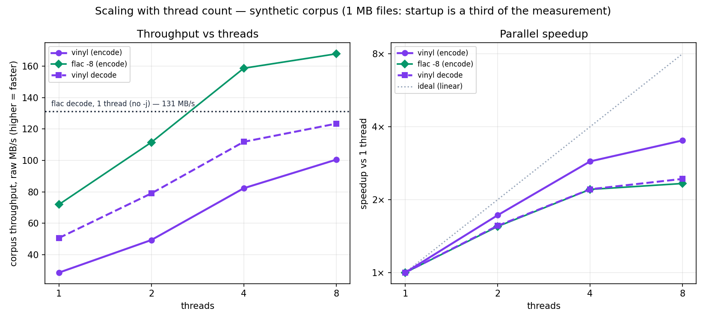
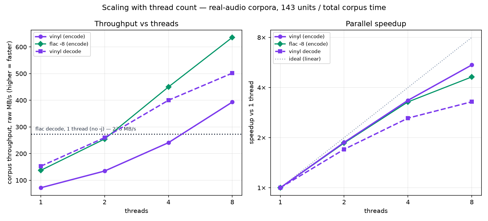

# Benchmarks

## Where Vinyl stands against libFLAC

**Per thread, Vinyl is 1.9–2.3× slower than libFLAC 1.5.0 on encode and
1.8–1.9× slower on decode, and compresses 4–5% worse. It parallelises better
than libFLAC, so the encode gap narrows with thread count — to 1.7× on the
synthetic corpus and 1.6× on real audio at eight threads. The decoder passes
libFLAC's single-threaded decoder between two and four threads on real audio;
on the synthetic corpus it does not pass it in the swept range, reaching 1.04×
behind at eight threads.** The two corpora differ because the synthetic files
are 1 MB, where per-file fixed cost bounds the gain (see
[the file-size note](#read-the-corpus-numbers-with-the-file-size-in-mind)).

Wall-clock throughput, corpus totals (total raw MB ÷ total seconds), at equal
thread counts. Measured **2026-09-09 on a 16-core AMD Ryzen 9 9950X (Zen 5)**
against flac 1.5.0; the gaps are same-run comparisons, the absolute rates are
specific to that machine:

| threads | encode vs `flac -8` | decode vs `flac -d` |
|---:|---|---|
| 1 | 2.3× / 1.9× slower | 1.9× / 1.8× slower |
| 2 | 2.1× / 1.9× slower | 1.4× / 1.05× slower |
| 4 | 2.0× / 1.9× slower | 1.1× slower / 1.5× faster |
| 8 | **1.7× / 1.6× slower** | **1.04× slower / 1.8× faster** |

*First figure is the synthetic corpus, second the real-audio corpus. libFLAC's
decoder takes no `-j`, so every decode row compares N Vinyl threads against
libFLAC's only configuration — which is why the comparison improves with
threads and why the 1-thread row is the like-for-like one.*

| compression, coded frames | Vinyl | `flac -5` | `flac -8` |
|---|---|---|---|
| real audio, 143 units | 47.9% | 46.1% | **45.5%** |
| synthetic, 37 files | 40.6% | 40.2% | **39.0%** |

**Every unit's coded size is unchanged from the 2026-08-27 run on different
hardware** — all 143 of them, not just the totals. That is the strongest single
check in this dashboard: the optimization work did not move the encoder's
output. It is a size comparison, not a byte comparison; `real_results.csv`
records sizes only. Byte identity is verified separately, against frozen
reference streams, outside this dashboard.

How to read that:

- **The per-thread number is the codec comparison.** ~2× on encode and ~1.9× on
  decode, and the fact that the two directions now carry similar factors points
  at per-operation cost — pure Lean against `int32` SIMD — rather than anything
  structural about one path.
- **Vinyl scales better.** From 1 to 8 threads it gains 3.0× (synthetic) and
  5.5× (real) on encode, against libFLAC's 2.3× and 4.6×. Every decoder fast
  path is proven equal to its bit-level specification, frame-parallel decoding
  and serialization included, so that scaling is not bought with trust.
- **Decoding gets faster with more threads, and that is the one place Vinyl
  wins on wall clock**: 502 MB/s against libFLAC's 273 MB/s on real audio at
  eight threads. libFLAC cannot answer, because it has no threaded decoder.
- **`flac -8` compresses better on both corpora**, and so does `flac -5`. There
  is no libFLAC preset Vinyl beats on both speed and ratio.

### What changed since 2026-08-27, and what is the machine

The previous publication was an 18-core Apple M5 Max; this one is Zen 5, and
optimization work landed in between (`../PROGRESS.md`). Those two effects push
in opposite directions and both are visible:

| real audio, 1 thread | M5 Max (2026-08-27) | Zen 5 (2026-09-09) | Vinyl | libFLAC |
|---|---|---|---|---|
| encode | 46 / 102 MB/s (2.2× gap) | 72 / 137 MB/s (1.9× gap) | 1.57× faster | 1.34× faster |
| decode | 68 / 252 MB/s (3.7× gap) | 153 / 273 MB/s (1.8× gap) | **2.25× faster** | 1.08× faster |

| synthetic, 1 thread | M5 Max | Zen 5 | Vinyl | libFLAC |
|---|---|---|---|---|
| encode | 46.6 / 87.6 MB/s (1.9× gap) | 63.9 / 144.0 MB/s (2.3× gap) | 1.37× faster | **1.64× faster** |
| decode | 69.8 / 149.9 MB/s (2.1× gap) | 122.7 / 230.7 MB/s (1.9× gap) | 1.76× faster | 1.54× faster |

The real-audio **decode** gap closed from 3.7× to 1.8×, and the synthetic
**encode** gap *widened*, from 1.9× to 2.3×. These four rows do not attribute
either change: they are eight numbers from two machines, and libFLAC is not a
calibration constant across them — its decoder gained 1.08× on real audio but
1.54× on synthetic between the very same pair, a spread that says at least one
row is dominated by something other than compute. Read them as observed history.
What the optimization work bought is measured on one machine against a frozen
baseline, off this dashboard; the direction of these rows is consistent with it,
not evidence for it.

The hardware change is nonetheless the larger term on the synthetic corpus:
libFLAC gained 1.64× there against Vinyl's 1.37×, its x86 SIMD paths being
relatively stronger than its NEON ones, while Vinyl's cost is flat integer work
— and those files are ~1 MB, where per-file fixed cost is a larger share of a
faster codec's time.

Ratios transfer between machines only loosely, then; absolute rates not at all.
Quote the row, the corpus and the machine together.

Nothing here is a proof claim. What is proven is that the codec is lossless and
that its fast paths compute their specifications; speed and ratio are measured,
and are what the rest of this file is about.

### Which gap is quoted

**One accounting, everywhere: corpus rate — total raw MB ÷ total seconds.** It
is what every table, every figure's dashed levels and legend, and every prose
"×N" in this file report, so any two numbers here are comparable without
checking which is which.

The alternative is the *per-unit median*: sort the units by throughput, take the
middle one, divide. It is not used. On the current run it reads ×1.56 where the
corpus rate reads ×1.62 — 4% apart — and how far apart the two sit is not
stable, nor even consistent in sign: an earlier run on other hardware had the
median *above* the corpus rate (×1.91 against ×1.78), and two before that were
2% apart (×2.13 against ×2.11) and 9% apart (×2.43 against ×2.22).

| encode, 8 threads | vinyl | `flac -8` | gap |
|---|---:|---:|---:|
| corpus rate, ΣMB ÷ Σs | 393.2 MB/s | 635.6 MB/s | **1.62×** |
| per-unit median | 408.1 MB/s | 638.3 MB/s | 1.56× |
| per-unit mean | 396.8 MB/s | 627.9 MB/s | 1.58× |
| coefficient of variation | 0.13 | 0.15 | |

The mechanism is SQAM's weight. It is **70 of 143 units but only 33% of the
bytes**, so equal-per-unit weighting gives it half the say and byte weighting a
third — and SQAM is exactly where the two encoders diverge least (gap 1.47×
there against 1.65× and 1.73× on the two LibriSpeech suites, because `flac -8`
pays an exhaustive mid/side decision on stereo that Vinyl's heuristic decides
directly).
A corpus rate is also a harmonic mean, so it is pulled toward whichever units
take longest. Those two effects act in opposite directions and neither is small
enough to ignore, which is why their sum changed sign between two runs of the
same suite.

Corpus rate wins the tie for three reasons, in order of weight:

1. **Unit boundaries are a corpus construction choice.** SQAM is one unit per
   track; LibriSpeech is concatenated per *speaker*
   ([what a benchmark unit is](#what-a-benchmark-unit-is)). Regroup the same
   audio differently and the median gap moves while the corpus gap barely does.
   A headline must not depend on how the corpus was cut up.
2. **It is the wall clock.** Encoding this corpus really does take 1.62× longer.
3. **It is already the ratchet.** The thread-scaling tables, the parallel
   speedup figures and the performance targets in `PROGRESS.md` are all corpus
   rates.

Per-unit medians are still worth reading — for *ratio*, where the median unit
says something the byte-weighted total hides, and as the distribution context
the throughput figures are for. They are labelled "median unit" wherever they
appear. A bare "×N" in this file is always a corpus rate.

Two other things called "median" here are unrelated to either: each case is run
several times and the **median repetition** is what lands in the CSV
([how the real suite is measured](#how-the-real-suite-is-measured)), and the
size sweep in Part 3 reports medians across its repetitions too.

## The two suites

| suite | material | units | raw PCM | what it is for |
|---|---|---:|---:|---|
| [**Part 1 — synthetic micro-benchmarks**](#part-1--synthetic-micro-benchmarks) | 37 generated 1 MB signals | 37 | 37 MB | per-category coverage, regression detection |
| [**Part 2 — real audio**](#part-2--real-audio-benchmarks) | EBU SQAM + LibriSpeech recordings | 143 | 1.73 GiB | the headline numbers |
| [**Part 3 — optimization history**](#part-3--optimization-history) | a 32 MB probe | 1 | 32 MB | what each tuning stage bought |

All percentages are compression ratios: encoded size as a fraction of the raw
PCM, so 100% means no compression and **lower is better**. All throughputs are
raw PCM MB/s of wall time, so **higher is faster**.

Part 1 comes first because it is the cheap one to run — a few minutes, and it
attributes a compression change to a *content category*. Part 2 is where the
numbers above come from: its units are large enough that process startup is not
being measured. **Never quote a number from one suite against a baseline from
the other**, and never against a dashboard produced by the pre-2026-08-23 shell
harness (see [the timing note](#the-timing-note-that-invalidates-older-dashboards)).

Both suites sweep thread counts. `BENCH_THREAD_SWEEP` (default `1,2,4,8`,
clamped to the core count) applies to both, `BENCH_RUNS` sets measured
repetitions, and `BENCH_THREADS` caps the core count.

---

## Part 1 — Synthetic micro-benchmarks

Thirty-seven generated 16-bit signals from [`gen_corpus.py`](gen_corpus.py) in
six content categories — tonal, waveforms, noise, tonal+noise mixes, degenerate
signals, stereo pairs — at 1 MB each. Each file isolates one property of the
format, which is what makes this suite useful for attributing a compression
change to a category. It is a **micro-benchmark**, not a proxy for audio: for
that, read [Part 2](#part-2--real-audio-benchmarks).

```sh
./bench/run.sh            # five measured runs per case by default
BENCH_RUNS=15 ./bench/run.sh
BENCH_THREAD_SWEEP=1,8 ./bench/run.sh
python3 bench/plot.py     # re-render plots/tables from an existing results.csv
```

`corpus/`, `out/`, `results.csv`, `summary.md`, and the three PNGs are all
generated artifacts.

### The timing note that invalidates older dashboards

Timing is owned by one persistent Python parent process. The original shell
harness launched `python3` separately for every timestamp; the startup of the
second timestamp process added roughly 19–22 ms to every codec invocation. That
fixed surcharge was especially large beside libFLAC's 7–10 ms of work on these
1 MB files, so the old dashboard substantially understated the relative gap.
**Results produced by the pre-2026-08-23 harness must not be compared with
results produced by the current one.**

### Read the corpus numbers with the file size in mind

These files are 1 MB each by design: `gen_corpus.py` sizes them for compression
coverage, not throughput. At that size **process startup is a third of the
measurement** — 3.1 ms of Lean runtime init against libFLAC's 2.7 ms, on an
8–9 ms decode, milliseconds measured on an earlier Apple benchmark
machine — and only 0.09 ms of Vinyl's share is this project's own module
initialization (a trivial Lean binary also takes 3.10 ms; the binary is already
statically linked against Lean, so there is no dynamic-loading cost to remove).

That fixed cost is also what limits the *scaling* measured below: a per-file
constant cannot be parallelised away, so both codecs scale worse here than they
do on Part 2's larger units. Read scaling off Part 2.

### Compression

Ratios are the **audio-frame payload**, metadata excluded. This matters far more
here than in Part 2: libFLAC's default 8,826 bytes of padding, seektable and
vendor comment are about 2.2% of the ~400 kB it emits for a 1 MB file, several
times the difference between the encoders being compared.

**Top** — per-file cactus: each encoder's ratios sorted ascending; a curve that
stays lower compresses better. **Bottom** — aggregate ratio per content
category:



| category | vinyl | flac -0 | flac -5 | flac -8 |
|---|---|---|---|---|
| tonal | 22.9% | 39.4% | 21.5% | **19.3%** |
| wave | **39.2%** | 43.7% | 43.1% | 40.1% |
| noise | 77.8% | 77.1% | **76.7%** | **76.7%** |
| mixed | 72.2% | 71.7% | 70.2% | **70.0%** |
| degen | 22.1% | 45.8% | **22.0%** | **22.0%** |
| stereo | 27.5% | 31.4% | 26.3% | **26.2%** |
| **TOTAL** | 40.6% | 48.6% | 40.2% | **39.0%** |

`flac -8` is ahead overall and in five of six categories, and since the encoder
dropped to a single LPC candidate so is `flac -5`: Vinyl wins only `wave`. This
is the corpus that pays for that change — tonal went 19.8% → 22.9% and the
total 39.6% → 40.6%, where real audio moved 0.1 points (see
`Flac.Heuristics.lpcCandidates`, which carries the whole curve). Whole-file
totals — the accounting this dashboard used until 2026-08-24 — are 40.6% /
49.4% / 40.9% / 39.8%, and the retracted "beats `flac -8`" claim came from that
column back when the payload total was 39.6%. See
[what the real corpus settled](#what-the-real-corpus-settled).

### Speed

**Top** — encode. **Bottom** — decode (the shipped buffered decoder). Per-file
throughput on a log scale, sorted slowest→fastest per implementation; dashed
horizontal lines mark the two **corpus rates** the arrow spans — the same
total-raw-MB ÷ total-seconds accounting as every table here — and every legend
entry carries its thread count and its corpus rate. Each implementation is drawn **twice**, in its own
colour — at eight threads and at one — so the per-thread gap is legible
straight off the figure: Vinyl's single-threaded encode curve sits at the
bottom, about 4× below `flac -8`'s. The `-0` and `-5` presets are compression
context rather than speed baselines, so they are quoted below instead of
plotted.



### Thread scaling

**Left** — corpus throughput against thread count; libFLAC's decoder takes no
`-j`, so it is a dotted reference level rather than a curve. **Right** —
parallel speedup against the ideal line.



Five-run repetition medians, aggregated to corpus totals, 2026-09-09 (Zen 5):

| threads | vinyl encode | `flac -8` encode | encode gap | vinyl decode | `flac` decode | decode gap |
|---:|---|---|---|---|---|---|
| 1 | 63.9 MB/s | 144.0 MB/s | 2.25× | 122.7 MB/s | 230.7 MB/s | 1.88× |
| 2 | 106.6 MB/s | 219.5 MB/s | 2.06× | 170.5 MB/s | no `-j` | 1.35× |
| 4 | 157.0 MB/s | 310.3 MB/s | 1.98× | 207.8 MB/s | no `-j` | 1.11× |
| 8 | 192.8 MB/s | 335.1 MB/s | **1.74×** | 221.3 MB/s | no `-j` | **1.04×** |
| **speedup** | **3.02×** | 2.33× | | 1.80× | — | |

Every decode row below the first is N Vinyl threads against libFLAC's only
configuration, so the gap shrinks with threads by construction. **It does not
reach parity in the swept range**: at eight threads Vinyl is still 1.04× behind
one libFLAC thread on this corpus. Part 2's units are large enough that it does.

Both codecs scale poorly here for the same reason — 1 MB files, so a fixed
per-file cost bounds the gain — and libFLAC still scales worse (2.33×) than
Vinyl (3.02×) because its share of fixed cost is larger relative to its work.
That is an artifact of the corpus, not a property of the codecs; Part 2 measures
the same thing on units where it is not.

Compared with the 2026-08-27 M5 Max run (46.6 / 87.6 encode, 69.8 / 149.9
decode at one thread), **the encode gap on this corpus widened, 1.88× → 2.25×**
and the decode gap closed, 2.15× → 1.88×. Vinyl's synthetic encode gained 1.37×
from the hardware change and libFLAC's 1.64×; on a corpus of 1 MB files the
faster codec's fixed cost is a larger share, and libFLAC's x86 SIMD is
relatively stronger than its NEON. Machine and code changed together here, so
neither movement is attributable from these rows; Part 2 is the corpus to judge
either direction on.

Run-to-run spread differs by direction: repeating the whole run moves the
*decode* gap by ~1% but the *encode* gap by ~5%. Quote these gaps to two
significant figures, only ever against baselines from the same run — and prefer
Part 2, or the 32 MB probe in Part 3, for judging a change.

### Throughput against file size

Same material, repetition medians, single-threaded libFLAC against all-core
Vinyl — a comparison this table predates the correction of, kept because the
*shape* is what it is for:

| PCM | Vinyl decode | libFLAC | gap | Vinyl encode | `flac -8` | gap |
|---|---|---|---|---|---|---|
| 1 MB | 104.4 MB/s | 121.7 MB/s | 1.17× | 70.9 MB/s | 70.7 MB/s | 1.00× |
| 2 MB | 140.3 MB/s | 150.9 MB/s | 1.08× | 82.3 MB/s | 81.8 MB/s | 0.99× |
| 4 MB | 178.8 MB/s | 168.7 MB/s | 0.94× | 89.6 MB/s | 87.0 MB/s | 0.97× |
| 8 MB | 198.7 MB/s | 178.6 MB/s | 0.90× | 94.8 MB/s | 89.4 MB/s | 0.94× |
| 16 MB | 209.7 MB/s | 185.9 MB/s | 0.89× | 95.9 MB/s | 90.5 MB/s | 0.94× |
| 32 MB | 217.2 MB/s | 189.6 MB/s | 0.87× | 97.0 MB/s | 91.6 MB/s | 0.94× |

The point of the table is that **throughput keeps climbing until about 8 MB**,
because below that Lean's fixed process init decides the comparison. The `gap`
columns are eight Vinyl threads against one libFLAC thread and should not be
read as codec ratios; the thread-matched numbers are above and in Part 2.

## Part 2 — Real-audio benchmarks

### What the real benchmarks are

The synthetic corpus in [Part 1](#part-1--synthetic-micro-benchmarks) is 37
*generated* signals — sine sweeps, square waves, white and brown noise, deliberately degenerate cases like pure silence
and samples with three wasted low bits. It is good at what it is for: each file
isolates one property of the format, so a compression regression can be
attributed to a content category. What it is not is *audio*, and two conclusions
this repository drew from it turned out to be artifacts of that (see
[what the real corpus settled](#what-the-real-corpus-settled)).

The real-audio suite encodes actual recordings — instruments, voices, orchestra,
pop mixes, read speech in clean and noisy conditions — at sizes where a codec
invocation measures the codec rather than process startup.

#### The corpora

| corpus | selector | archive | prepared PCM | native format | licence |
|---|---|---:|---:|---|---|
| **EBU SQAM** (Tech 3253) | `sqam` (default) | 167.4 MiB | 620 MB, 70 tracks | 2ch 44.1 kHz S16 | R&D use; no other commercial use |
| **LibriSpeech `test-clean`** | `librispeech-test-clean` | 330.6 MiB | 622 MB, 2,620 utterances | 1ch 16 kHz S16 | CC BY 4.0 |
| **LibriSpeech `test-other`** | `librispeech-test-other` | 313.5 MiB | 615 MB, 2,939 utterances | 1ch 16 kHz S16 | CC BY 4.0 |

**SQAM** is the European Broadcasting Union's sound-quality assessment material:
70 short tracks chosen to *stress* codecs, categorised by Tech 3253 into
alignment tones, artificial signals, 36 single instruments, solo instruments,
vocals, speech, vocal-orchestra, orchestra, and pop. It is already in Vinyl's
native encoder format, and it is deliberately harder than a music library —
single instruments recorded dry have far less to correlate away than a mix.

**LibriSpeech** is read English audiobook speech from LibriVox, 16 kHz mono. The
two `test` splits are the standard held-out sets: `test-clean` is the
higher-recording-quality half, `test-other` the harder half. Speech at 16 kHz is
the least compressible material in this suite (about 55% of raw, against 27% for
single instruments), and it exercises a sample rate and channel count that SQAM
does not.

#### Why these two, and not the others

[`CORPORA.md`](CORPORA.md) also records identities and fetch commands for
FSD50K evaluation audio (6.2 GB), MUSDB18-HQ (22.7 GB), and MAESTRO v3 (101 GB).
Those are deliberately **not** part of this suite: at 1.73 GiB the two corpora
here already run six measured passes in about fifteen minutes, and adding an
order of magnitude of audio buys resolution the comparison does not need — the
gaps being measured are 3× and 5%, not 2%. They remain documented for anyone who
wants a music-mixture or general-audio corpus later.

#### What a benchmark unit is

`real_fetch.py` writes one canonical S16LE PCM file per source recording.
That is the right granularity for SQAM, whose tracks are 2.6–46.9 MB. It is not
the right granularity for LibriSpeech, whose utterances average 0.22 MB: at that
size a codec invocation is dominated by process startup, which is a real cost
but not the one being measured here.

[`real_units.py`](real_units.py) therefore builds the benchmark units:

- **SQAM** — one unit per track, benchmarked in place. 70 units, median 5.9 MB.
- **LibriSpeech** — one unit per *speaker*, concatenating that speaker's
  utterances in sorted order into a single stream. 73 units (40 clean, 33
  other), 5.1–19.8 MB. Concatenation is raw-PCM only: no resampling, no gain,
  no reordering, and both codecs receive byte-identical input. Speaker is the
  coarsest grouping the corpus labels, which keeps the streams large without
  mixing voices inside a unit.

`units.csv` records each unit's format, byte count, source-file count, and
SHA-256, so a run is reproducible against a specific set of streams.

#### Reproducing it

```sh
python3 bench/real_fetch.py --list                  # what is available
python3 bench/real_fetch.py --accept-ebu-terms      # SQAM (review EBU terms first)
python3 bench/real_fetch.py --corpus librispeech    # both LibriSpeech test splits
./bench/real_run.sh                                 # units, measure, plot
```

**Fetch all three suites before publishing anything from this file.**
`real_run.sh` measures whatever `real_data/manifest.csv` happens to hold and
says so only in one line of its own output, so a machine missing
`librispeech-test-other` produces a complete-looking run over **110 units
instead of 143** — and the compression totals move by nearly four points
(44.1% against 45.5% for `flac -8`, versus 47.9% against 45.5% on the full
corpus) purely because the noisiest speech suite is absent. That has happened,
and was caught only by comparing the unit count with the committed CSV. Check
`wc -l bench/real_data/units.csv` reads 143 before believing a total.

[`CORPORA.md`](CORPORA.md) has the category selectors, licence restrictions,
checksums and prepared-corpus layout; [`real_corpora.lock.json`](real_corpora.lock.json)
pins the exact archives these numbers were produced from, with locally observed
SHA-256 digests.

`BENCH_RUNS` sets measured repetitions (default 5), `BENCH_THREADS` the thread
count both codecs get for their multithreaded rows (default: all cores),
`BENCH_SUITES` restricts to a comma-separated subset, and `BENCH_LIMIT` caps the
unit count for a smoke run. Audio, prepared PCM, streams and encoder output all
live under ignored directories; nothing in this section is committed except the
scripts, the figures, `real_results.csv` and `real_summary.md`.

#### Clearing and re-fetching

`real_fetch.py` has no `--force`; every stage reuses what it finds, so a refetch
is a matter of deleting the right directory under `bench/real_data/`. What each
stage reuses:

| delete | effect | cost to rebuild |
|---|---|---|
| `downloads/` | re-downloads the publisher archives | 811.5 MiB over the network |
| `source/` | re-extracts the FLAC files from the archives | extraction only, 867 MB |
| `pcm/` **and** `manifest.csv` | re-decodes every source file to S16LE | `flac -d` over 5,629 files, 1.7 GB |
| `streams/` **and** `units.csv` | rebuilds the 143 benchmark units | concatenation only, 1.2 GB |
| the whole `bench/real_data/` tree | starts over from nothing | all of the above, 4.6 GB |

`rm -rf bench/real_data` then re-running the two fetch commands and
`./bench/real_run.sh` reproduces the corpus from the publishers. Three details
decide whether a partial delete does what you want:

- **An archive already in `downloads/` is never re-downloaded** — it is verified
  and reused. Corruption is caught rather than tolerated (LibriSpeech against
  the publisher's MD5, SQAM against the SHA-256 sidecar the first fetch wrote),
  but the script *fails* on the mismatch instead of refetching: the error says
  to remove the file, and removing it is what triggers the download.
- **PCM is reused only when it still matches** its manifest row: source SHA-256,
  byte count, and STREAMINFO MD5 all have to agree, so deleting `manifest.csv`
  alone forces a full re-decode even with `pcm/` intact.
- **Units are reused on size alone.** `real_units.py` keeps an existing stream
  whose length is what it expects, so if you change how units are cut, delete
  `streams/` and `units.csv` — nothing else will notice.

Encoder output and decoded PCM land in `bench/real_out/` instead, which is
separate and safe to delete at any time — a run rewrites each unit's files as it
reaches that unit, and keeps them afterwards, so the directory grows to ~7 GB
and stays there. Budget ~12 GB for a full local suite, or delete `real_out/`
after each run.

### How the real suite is measured

Timing is the same instrument as Part 1: one persistent Python parent holding a
`perf_counter_ns`, one untimed warmup per case, then `BENCH_RUNS` measured runs
whose order is shuffled with a fixed seed so no implementation keeps the same
thermal and cache position. The reported number is the median across those
repetitions — not a median across units, which this suite never quotes as a
gap. Correctness
checks run outside every timed interval.

Three things differ from the synthetic suite, each because real audio made them
measurable:

**1. Sizes are recorded twice.** libFLAC writes 8,826 bytes of padding,
seektable and vendor comment per file at its defaults; Vinyl writes STREAMINFO
alone, 42 bytes. `real_results.csv` therefore carries both `bytes` (whole file)
and `audio_bytes` (the coded frames, found by walking the metadata block headers
— [`flacsize.py`](flacsize.py)). Only the payload column can support a
compression claim. On these units the distinction is cosmetic — 8.8 kB against a
15 MB stream — which is exactly why it had to be measured here: it is *not*
cosmetic on Part 1's 1 MB files.

**2. Both codecs are swept over thread counts.** libFLAC 1.5.0 takes `-j` and
Vinyl is frame-parallel in both directions, so no single thread count
characterises either: `BENCH_THREAD_SWEEP` (default `1,2,4,8`, clamped to the
core count) runs Vinyl encode, Vinyl decode and `flac -8` at every count.
Vinyl's pool is sized by `LEAN_NUM_THREADS`, which the Lean runtime reads
before `main` is entered — that is why the `vinyl -j` flag re-executes, and why
the harness sets the variable directly and pays no re-exec. `-j` changes
scheduling only: the plot script *checks* that each unit's coded size is
identical across thread counts rather than assuming it.

libFLAC's **decoder** has no threading option — `-j` is documented under
encoding options, and `flac -d -j8` is silently accepted and ignored (measured:
0.0448 s against 0.0445 s on the same file, exit 0 either way). So the decode
row exists at one thread only, and Vinyl's decoder is compared against
libFLAC's sole available configuration. The single-thread column is what makes
that legible.

**3. Every unit is cross-decoded.** Per unit, outside the timed intervals: `flac
-t` accepts Vinyl's stream and its MD5 signature; Vinyl's `--decode-fast`
reproduces the input exactly; and **Vinyl's decoder reproduces libFLAC's `-8`
stream exactly**. All three passed on all 143 units — the harness aborts on the
first mismatch. The third is the interesting one: 1.73 GiB of libFLAC-encoded
real audio, at the preset that uses the widest search, decoded byte-for-byte by
the verified decoder. That is interoperability evidence, not a theorem, which is
why it is tested.

### Compression

**Top** — per-unit cactus: each encoder's audio-frame ratios sorted ascending, so
a curve that stays lower compresses better. **Bottom** — aggregate ratio (total
coded bytes ÷ total raw bytes) per content category. `flac -8 -j8` is omitted
from both: every unit's coded size matches `flac -8`, so it would draw a
duplicate curve.


| category | units | vinyl | flac -5 | flac -8 |
|---|---:|---|---|---|
| alignment | 2 | 23.5% | 22.0% | **20.9%** |
| artificial | 5 | 8.3% | 7.8% | **7.4%** |
| single-instrument | 36 | 29.2% | 27.4% | **27.1%** |
| solo-instrument | 6 | 32.6% | 30.8% | **30.5%** |
| vocal | 5 | 35.4% | 33.2% | **32.6%** |
| vocal-orchestra | 4 | 41.7% | 39.6% | **39.3%** |
| orchestra | 4 | 34.2% | 32.2% | **32.1%** |
| pop | 2 | 40.7% | 38.9% | **38.4%** |
| speech | 6 | 32.0% | 30.8% | **30.4%** |
| speech-clean | 40 | 57.7% | 55.9% | **55.2%** |
| speech-other | 33 | 55.5% | 53.6% | **52.9%** |
| **TOTAL** | **143** | 47.9% | 46.1% | **45.5%** |

**`flac -8` compresses real audio better than Vinyl in every category**, and so
does `flac -5`. The median unit is **5.3% larger** than `flac -8`'s output (3.8% against `flac -5`), and the
2026-08-24 encoder speedups moved this total by 0.3 points, from 47.6% — about
a third of what the same changes cost on the synthetic corpus (1.0 points).

Including metadata does not change this — whole-file totals are 47.9% / 46.1% /
45.6% — because 8.8 kB is nothing against a 15 MB unit. That equality is the
point: it is the control that shows the metadata correction in Part 1 is real
rather than an accounting preference.

### Speed

Per-unit throughput, log scale, sorted slowest→fastest per implementation; a
curve that sits higher is faster. Dashed horizontal lines mark the two
**corpus rates** the arrow spans, and every legend entry carries its thread
count and its corpus rate — one accounting across figures, tables and prose
(see [which gap is quoted](#which-gap-is-quoted)). Each
implementation is drawn **twice**, in its own colour — at eight threads and at
one — so the per-thread comparison and the thread-matched one are both on the
same axes. `flac -5` is compression context and is tabulated below rather than
plotted. **Top** — encode. **Bottom** — decode (the shipped buffered decoder).


Corpus throughput — total raw MB ÷ total seconds, which weights by size rather
than by unit and so is the number to quote for aggregate speed:

| suite | vinyl `-j8` | flac -5 `-j1` | flac -8 `-j1` | flac -8 `-j8` | vinyl decode `-j8` | flac decode `-j1` |
|---|---|---|---|---|---|---|
| sqam | 422 MB/s | 265 MB/s | 117 MB/s | **620 MB/s** | **505 MB/s** | 289 MB/s |
| librispeech-test-clean | 405 MB/s | 303 MB/s | 155 MB/s | **669 MB/s** | **539 MB/s** | 276 MB/s |
| librispeech-test-other | 358 MB/s | 285 MB/s | 145 MB/s | **621 MB/s** | **466 MB/s** | 256 MB/s |
| **TOTAL** | 393 MB/s | 283 MB/s | 137 MB/s | **636 MB/s** | **502 MB/s** | 273 MB/s |

#### Scaling, and the per-core comparison

**Left** — corpus throughput against thread count; libFLAC's decoder cannot be
swept, so it is a dotted reference level rather than a curve. **Right** —
parallel speedup against the ideal line.



| threads | vinyl encode | `flac -8` encode | vinyl decode | `flac` decode |
|---:|---|---|---|---|
| 1 | 72 MB/s | 137 MB/s | 153 MB/s | 273 MB/s |
| 2 | 135 MB/s | 255 MB/s | 260 MB/s | no `-j` |
| 4 | 241 MB/s | 450 MB/s | 400 MB/s | no `-j` |
| 8 | 393 MB/s | 636 MB/s | 502 MB/s | no `-j` |
| **speedup** | **5.47×** | 4.63× | 3.29× | — |

**Per core, Vinyl is about 1.9× behind on encode and 1.8× on decode** — encode
1.90× (72 vs 137 MB/s), decode 1.78× (153 vs 273 MB/s). That is the
like-for-like comparison, and two near-equal factors rather than one bad path
says the distance is per-operation cost rather than anything structural.

Decode was 3.7× behind on this corpus in the 2026-08-27 publication and is
1.78× behind now; the encode gap closed less, 2.2× → 1.90×. That publication was
different hardware, so the two effects are not separable here (see
[what changed since 2026-08-27](#what-changed-since-2026-08-27-and-what-is-the-machine)).

The one thing that favours Vinyl is that **it scales better**: 5.47× on eight
threads for encode against libFLAC's 4.63×, so the encode gap narrows from
1.90× at one thread to 1.62× at eight. Vinyl's decoder now crosses libFLAC's
single-threaded decode level between **two and four threads** — which is the
whole content of the "decode is ahead" result below.

Reading the wall-clock comparisons in order of how much they are worth:

- **Per core, encode is 1.90× behind and decode 1.78× behind.** The honest
  per-operation numbers.
- **Thread-matched at eight, encode is 1.62× behind** (393 vs 636 MB/s).
- **Against single-threaded `flac -5`, encode is 1.39× ahead** at eight
  threads (393 vs 283 MB/s) — but `flac -5` still compresses better, so there
  is still no libFLAC preset Vinyl beats on both axes.
- **Against single-threaded `flac -8`, encode is 2.87× ahead** (393 vs
  137 MB/s). This is the preset's default configuration and the historical
  reference in Part 3, but it is eight threads against one.
- **Decode is 1.84× ahead** (502 vs 273 MB/s) — eight threads against one,
  because libFLAC offers no other decode configuration.

The SQAM column is where the two encoders diverge least: `flac -8` drops to
117 MB/s on stereo 44.1 kHz material against 145–155 MB/s on mono speech, while
Vinyl runs *faster* on SQAM (422 MB/s) than on LibriSpeech (358–405). Stereo
costs libFLAC's `-8` an exhaustive mid/side decision that Vinyl's certified
heuristic decides directly.

### What the real corpus settled

Two claims this repository carried from the synthetic corpus do not survive.

**"Vinyl's compression beats `flac -8`."** It does not, and it never did — the
comparison was whole-file, and libFLAC's metadata is four times the 0.5%
relative difference the claim rested on
([why sizes are recorded twice](#how-the-real-suite-is-measured)). Re-measured
on coded frames at the same commit, the synthetic corpus gave Vinyl 39.6%
against `flac -8`'s **39.0%**, and real audio 47.6% against 45.5%; the encoder
has since traded 1.0 synthetic points for 28% of throughput, so those columns
now read 40.6% and 47.9% (Part 1). `flac -8` was ahead on both corpora all
along.

**"Encode is at parity with `flac -8`."** At one thread each it is not close —
libFLAC 1.5.0 has `-j` and Vinyl has been frame-parallel since session 6, so
parity against the single-threaded default was measuring a thread count, not a
codec. Per thread the encode gap is **1.90×**; thread-matched at eight it is
1.62×.

**"Decode is ahead of libFLAC."** True on wall clock at eight threads (1.84×),
and it was labelled as eight threads against one — but the thread sweep shows
what that label was hiding. Per thread the decoder is **1.78× behind**, and
Vinyl's decode curve crosses libFLAC's single-threaded level between **two and
four threads**. The win is real for a user on a multicore machine and it is the
only wall-clock win Vinyl has; it is not a statement about the decoder's
per-operation speed. (When this section was first written the per-thread decode
gap was 3.7×; it is 1.78× now, so the caveat is much smaller than it was — but
it is still a caveat.)

What holds up:

- **Vinyl parallelises better than libFLAC.** 5.47× on eight threads for
  encode against libFLAC's 4.63×, and 3.29× for decode against a libFLAC
  decoder that cannot scale at all. That is the direction where the proofs are
  deepest — every decoder fast path is proven equal to its bit-level
  specification, frame-parallel decoding and serialization included — so the
  scaling is not bought with trust.
- **Decoding is where Vinyl wins on wall clock**, 502 MB/s against libFLAC's
  273 MB/s at eight threads, and libFLAC has no threaded decoder to answer
  with.
- **Interoperability is solid.** 143/143 units round-trip through Vinyl, pass
  `flac -t`, and — in the other direction — libFLAC's `-8` output decodes
  byte-exactly under the verified decoder, at every thread count in the sweep.
- **The ratio is close, not competitive.** ~5% behind `flac -8` on the median
  unit is a search-quality gap, not a format gap:
  `Flac.Heuristics.lpcCandidates` carries the measured tradeoff curve, and
  [where the remaining encode gap is](#where-the-remaining-encode-gap-is)
  describes what libFLAC's `-8` buys with several apodization windows that Vinyl
  does not have.

**Where the distance actually is.** Per thread the gap is ~1.9× on encode and
~1.8× on decode, which is the informative part: a structural problem in one path
would not produce two near-equal factors. It is per-operation cost. libFLAC's
inner loops are `int32` SIMD; Lean offers `FloatArray` and `ByteArray` as its
only unboxed numeric arrays, `Array Int64` would be *worse* than `Array Int`
(boxed per element), and the LPC dot product has resisted five separate
attempts — see [Part 3](#part-3--optimization-history).

### Known gaps in this suite

- **No CPU-time accounting.** Every number is wall clock. The `-j1` rows give
  the per-core comparison directly, which is what the previous version of this
  list said was missing; what is still not recorded is `rusage` per
  invocation, so scheduling and SMT-sibling effects are not separated out.
  That is the likeliest reason neither codec scales linearly to eight
  threads even with cores to spare.
- **`flac -0` is not measured on real audio**, so Vinyl's ratio is bracketed
  from above by `flac -5` but not from below.
- **16-bit only, two sample rates.** Both corpora are S16; the codec and the
  theorems cover depths 4–32. No 24-bit or 96 kHz material is benchmarked.
- **SQAM may not be redistributed.** The fetcher verifies publisher identity and
  records hashes, but the audio stays local; a third party reproducing these
  numbers must accept the EBU terms themselves.

---

---

## Part 3 — Optimization history

Where each tuning stage got its speed, kept for anyone pushing further. Two
things to know before reading the tables:

- **Ratios quoted inside these stage tables are whole-file**, the accounting in
  use at the time. Statements like "still ahead of `flac -8`" are superseded by
  [Part 2](#what-the-real-corpus-settled); what the ratio columns still
  establish is what each stage did *not* change, which is what they were for.
- **Gap columns are against single-threaded `flac -8`.** They are stage-to-stage
  measurements, not a codec comparison; for that, see Part 2.

### Sessions 6–7: parallelism and the array-typed decoder

| stage | encode | decode | encode gap (`-8`) | decode gap |
|---|---|---|---|---|
| corrected-timer baseline | 13.9 MB/s | 30.6 MB/s | 5.2× | 4.0× |
| array-typed decoder core | 15.3 MB/s | 40.3 MB/s | 4.8× | 3.1× |
| frame-parallel decoding | 18.6 MB/s | 67.4 MB/s | 4.0× | 1.8× |
| parallel PCM serialization | 18.5 MB/s | 73.9 MB/s | 4.0× | 1.68× |
| decode task granularity | 18.8 MB/s | 78.0 MB/s | 3.9× | 1.58× |
| channel-major deinterleave | 21.4 MB/s | 78.6 MB/s | 3.5× | 1.59× |
| unboxed `FloatArray` search | 21.9 MB/s | 78.3 MB/s | 3.4× | 1.60× |
| deinterleave in the workers | 23.8 MB/s | 79.3 MB/s | 3.15× | 1.59× |
| parallel certificate serialize | 24.5 MB/s | 79.2 MB/s | 3.06× | 1.58× |

### Sessions 8–9: exact float arithmetic, and not allocating

Measured on the 32 MB probe (mono, 4096-sample blocks), so not comparable
with the corpus medians above — only with each other.

| stage | encode | decode | encode gap (`-8`) | decode gap |
|---|---|---|---|---|
| session 7 end | 26.7 MB/s | 108.8 MB/s | 3.53× | 1.85× |
| float candidate searches | 33.3 MB/s | — | 2.90× | — |
| bit writer without tuples | 42.8 MB/s | — | 2.27× | — |
| unboxed PCM serialization | 43.5 MB/s | 117.2 MB/s | 2.24× | 1.76× |
| parallel sync-code scan | 44.6 MB/s | 126.5 MB/s | 2.18× | 1.65× |
| fused fixed-order search | 47.1 MB/s | 127.5 MB/s | 2.07× | 1.59× |
| frame-parallel serialization | 46.6 MB/s | 220.7 MB/s | 2.07× | **0.96×** |
| certificate via the byte path | 57.7 MB/s | 222.2 MB/s | 1.67× | 0.94× |
| three-byte Rice window | 58.5 MB/s | 246.2 MB/s | 1.63× | **0.83×** |
| MD5 off the critical path | 64.9 MB/s | 244.3 MB/s | 1.48× | 0.85× |
| three LPC orders, not five | 71.7 MB/s | 246.2 MB/s | 1.34× | 0.84× |
| float residual for emission | 73.7 MB/s | 244.3 MB/s | 1.32× | 0.85× |
| three autocorrelation lags per pass | 75.5 MB/s | 244.3 MB/s | **1.27×** | 0.85× |

Every stage but one kept the corpus ratio at 39.580% and the output
byte-identical to the verified encoder's; "three LPC orders" moved it to
39.634%, still ahead of `flac -8`'s 39.784%.

### Session 10: proving the encoder, and retiring its certificate

Same 32 MB probe, `flac -8` at 92.3 MB/s on it. Every row is
byte-identical to the previous one — the whole project was a proof project,
and the only changes to what the encoder *computes* were forced by what can
be proven at all.

| stage | encode | decode | encode gap (`-8`) |
|---|---|---|---|
| session 9 end | 75.3 MB/s | 199.3 MB/s | 1.23× |
| `Int` residual emission | 69.2 MB/s | 214.9 MB/s | 1.33× |
| plan sanitisation | 68.6 MB/s | 213.0 MB/s | 1.35× |
| stage 3 complete | 68.8 MB/s | 214.7 MB/s | 1.34× |
| self-certifying payloads | 68.5 MB/s | 215.0 MB/s | 1.35× |
| **certificate retired** | 97.7 MB/s | 215.8 MB/s | **0.94×** |

The whole cost of provability was 10% — `Int` residual emission 8%, plan
sanitisation and the rest under 1% each — and retiring the certificate paid
30% back. Encode ends *ahead of* `flac -8` on this probe, at unchanged
compression, which is what M6b was for.

The one change that was not free is worth naming: residual bits used to
come off the search's `FloatArray`s, and `lpcResidualArrF`'s own doc
asserted the unprovable step ("every value is an exact integer, so the
bytes emitted from it are the bytes an `Int` residual would emit"). That is
precisely what the certificate was covering. `Float` is opaque in Lean —
its operations are compiler intrinsics with no axiomatization — so a float
in the *bytes* can never be reasoned about, and emission had to move to the
exact `Int` residual first. Costing candidates in `Float` stays free,
because a search that picks the wrong candidate loses compression, never
correctness.

**Exact float arithmetic in the searches — and now in emission.** A search
only *chooses* a subframe, and every value it computes is an integer well
inside 2^53 (for 16-bit input: samples below 2^17, quantized coefficients
below 2^11, order at most 8, so prediction sums below 2^32, residuals
below 2^19, 4096-sample partition sums below 2^32). IEEE-754 doubles
represent those exactly, so an unboxed `FloatArray` search picks the *same
subframe bit for bit* at one hardware `fmul`/`fadd` per tap instead of
`lean_int_mul`/`lean_int_add` on a boxed `Array Int`. The same holds for
the residual that gets *emitted*, so the `Int` residual path is gone
entirely and `pushRiceRange` folds the zigzag magnitude straight off the
float. A differential test pins all of it against the verified encoder on
LPC, FIXED, noise, wasted-bit, constant and stereo material.

Two Lean codegen facts drove the tuning, and both cost real time to find.
`Float`-typed `let mut` variables carried across a `for` loop are **boxed
once per iteration** — an order-8 residual fold went 84 ms → 255 ms when
its accumulators moved from tail-recursion parameters into ten mutable
locals — so every accumulator here is a tail-recursion parameter. And
`Prod`'s fields are polymorphic, so a returned tuple **boxes any scalar in
it**: `BitWriter.flushGo` returned `ByteArray × UInt64 × Nat`, three heap
allocations per *bit push*, which put about a quarter of all encode work in
the allocator beneath it. Both dropped components were recoverable without
the tuple.

**Frame-parallel serialization.** Turning decoded samples into interleaved
PCM bytes was 46% of decode wall time and none of it was decoding:
`recombineA` concatenated every frame's channel arrays into whole-file
arrays (41 ms, serial) and `pcmBytesA` walked those again (61 ms — its task
fan-out bought nothing, because marking the shared `Array Int` channels
multi-threaded cost about what the parallelism saved). A frame covers a
contiguous sample range, so a frame *is* a serialization window; each
worker now emits its own frame's bytes, and a `ByteArray` is O(1) to mark
where `Array Int` channels are O(samples). `Flac/Spec/PcmBytes.lean` proves
it rather than asserting it.

**Three autocorrelation lags per pass.** Nine lags meant nine passes over
the windowed block, each re-reading both operands of every product.
`acorr3` reads `w[i]` and `w[i-lag]` and carries `w[i-lag-1]`/`w[i-lag-2]`
in registers, so a (lag, sample) pair costs two thirds of a load instead
of two; each lag still accumulates ascending in `i` from `+0.0`, so the
sums stay bit-identical. Worth 2.4% of encode in the stage table above;
autocorrelation is about 6% of encode *work*.

**MD5 off the critical path.** The STREAMINFO digest is chained and cannot
be split across workers, but it does not have to be *first*: it was 62 ms
of a 550 ms encode, computed before the first frame task started. Spawned
alongside them, it overlaps work that was already saturating the cores.

**Measured and discarded.** A libFLAC-style *windowed* bit reader — cached
64-bit word plus a leading-zero count — was prototyped and came out **5.7×
slower** (207 ms vs 36 ms on a 2M-sample Rice run): Lean boxes `UInt64`
values carried across control flow, so refills and `clz` cost far more
than the scalar `Nat` path they replace. What survives of that idea is the
three-byte extraction window (1.35×). Also neutral or worse: unrolling the
float dot product with four accumulator chains (155 ms vs 83 ms — the
per-tap `Nat` index arithmetic costs more than the shortened dependency
chain saves), splitting it into two chains, a sliding register window,
holding the coefficients in a `FloatArray` walked by a counter instead of
a `List Float` walked structurally (a wash at order 4, *worse* at order 8),
`>>>3`/`&&&7` in place of `/8`/`%8` (identical), a constructor-level
`unzigzag` (identical), and lowering the sync-scan window below 1 MB. The
LPC dot product has now resisted five different attempts; treat ~5 cycles
per tap as the floor.

### Where the remaining encode gap is

On a large file the encoder is 6% ahead of *single-threaded* `flac -8`;
thread-matched on real audio it is 1.62× behind, and ~5% behind on ratio
([Part 2](#speed-1)). So the gap is real, and this is where it lives, for
anyone pushing further.

1. **The runtime certificate is gone.** It was ~30% of encode wall:
   decoding the encoder's own output to check it. Milestone M6b replaced it
   with a proof (`Flac.Encode.encodePcm16_eq`), and `ARCHITECTURE.md` walks
   the chain. What was never in the way is the searches — a chooser's
   output carries a decidable validity certificate by construction, so the
   round-trip theorem already held for every chooser, `Float` included; and
   `Float` did not block the *emission* theorem either, because a search
   and the chooser the reference is instantiated with need only be the same
   function on equal inputs.
2. **The candidate search: ~37% of encode work** (`lpcDotFf` 24%,
   autocorrelation 6%, the partition folds the rest). libFLAC's `-8`
   evaluates
   exactly one LPC order per apodization window and one fixed order
   (`compression_levels_` and `process_subframe_` in
   `src/libFLAC/stream_encoder.c` — `do_exhaustive_model_search` is false
   at every level), buying its ratio with several *windows* instead. Vinyl
   uses one window and one LPC order — the Levinson estimate winner — plus
   all five fixed orders, costed exactly. `Flac.Heuristics.lpcCandidates`
   carries the measured curve for trading that back.

Below those, per-operation cost is at the floor pure Lean offers.
libFLAC's inner loops are `int32` SIMD; `Array Int64` would be *worse*
than `Array Int` in Lean (boxed per element), and `FloatArray` — already
used everywhere it is exact — is the only unboxed numeric array Lean has
besides `ByteArray`.

### Where the remaining decode gap is

There is none above 4 MB. Below it the residual is Lean's fixed process
init, not decoding. Decode work now divides as: the Rice reader ~43%
(`readRiceSeqScan3` 38%, `scanOne` 5%), predictor restoration ~29%
(`Lpc.dotAGo` 23% — `Int` multiply-accumulate that must stay `Int`,
because it is the proven path and `Int → Int64` conversion per tap would
cost what it saves), `crc16` 6%, serialization ~9%, array pushes ~3%.

Compare corpus rates only *within the same run*; machine load and thermal state
move absolute throughput, which is why every figure plots both codecs
together and interleaves their measurements. And never against a dashboard
from the pre-2026-08-23 harness — see
[the timing note](#the-timing-note-that-invalidates-older-dashboards).

Both Vinyl paths retain zero proof debt. Decoder fast paths are proved equal
to their bit-level specifications, and since M6b the production *encoder* is
proved too: `Flac.Encode.encodePcm16_eq` shows it computes
`Flac.Stream.Unchecked.encode` at the configuration its own search denotes, so the
byte-level round trip follows from the reference capstone with no runtime
decode and no fallback.
